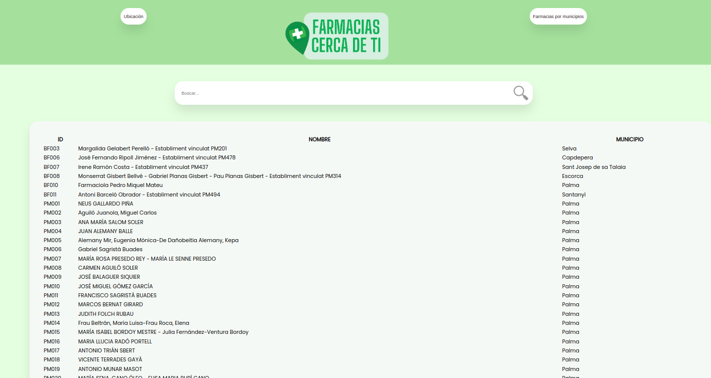
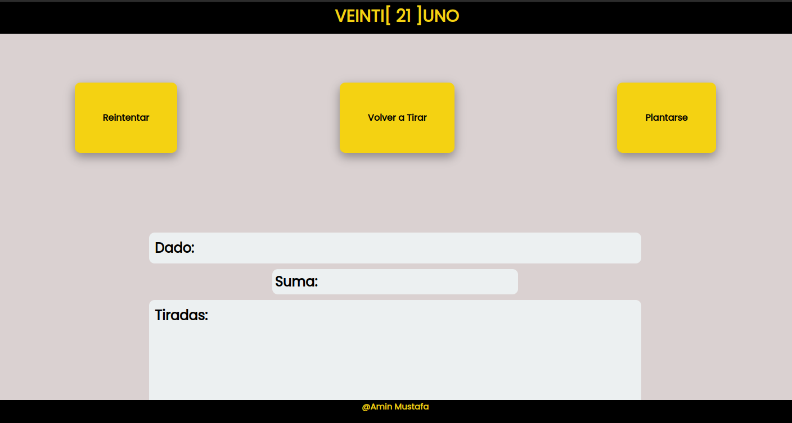
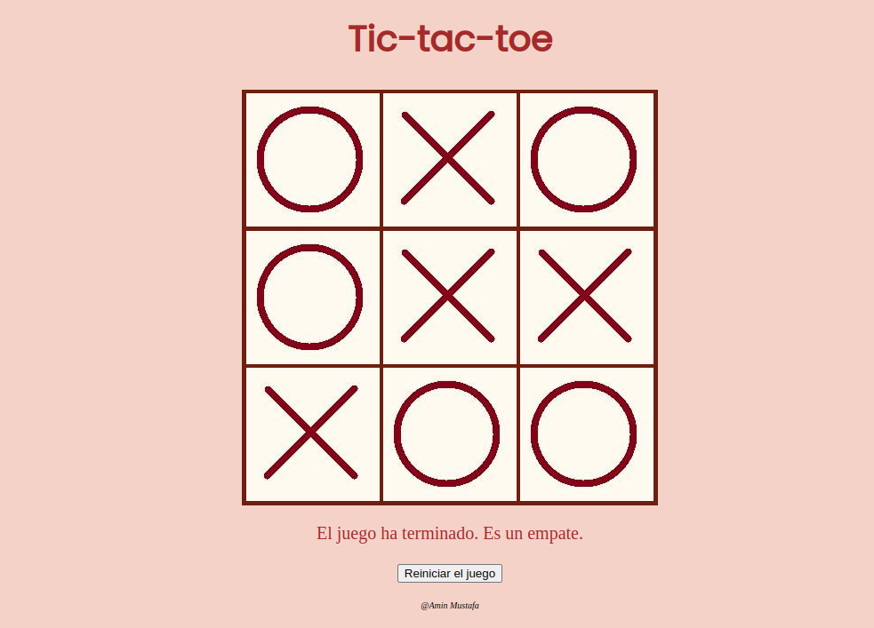
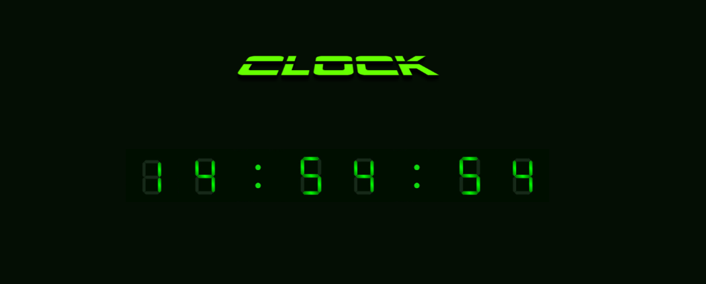
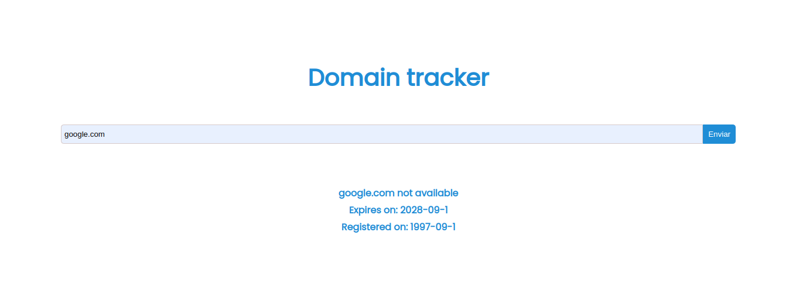

# Retos Javascript

En este repositorio encontrará diferentes directorios que contienen diferetes retos de programación en Javascript que he tenido que resolver para poder practicar la tecnología para el curso **intensivo** del Grado Técnico Superior de Aplicaciones Web para el CIFP Francesc de Borja Moll, en la asignatura Lenguajes de Marcas impartida por Tomás Ribot.

- [Índice de contenidos]()

    - [Gato Volador](#Gato-Volador)
    - [Juego Refejos](#juego-reflejos)
    - [Farmacias](#Farmacias)
    - [Veintiuno](#veintiuno)
    - [Tik-Tak-Toe](#tik-tak-toe)
    - [Reloj](#reloj)
    - [Buscador Dominios](#buscador-dominios)

# Gato Volador

El reto consiste en tener un gato en pantalla sobre un fondo y ser capaces de desplazarlo con las teclas "ArrowUp","ArrowDown","ArrowLeft","ArrowRight".

Para resolver el ejercicio he usado el método "addEventListener" que nos permite añadir una escucha del evento indicado en el primer parámetro.

Vista previa de la pantalla:


Pulsa aquí para ver el código: [código Gato Volador](./Gato%20volador/)

Uso:

Para poder probar el contenido debe clonar el repositorio en su equipo usando el siguiente comando después de haber creado un directorio en el que almacenarlo: 
```
git clone https://github.com/Aminmboankod/Retos-Javascript.git
```
Cuando tenga todo el contenido en su equipo diríjase al directorio "Gato Volador" y haga doble click sobre el fichero "index.html".
A continuación se le abrirá en su navegador por defecto. 

Para mover el "gato volador" puede hacerlo con las teclas dedirección de su teclado:


# Juego Reflejos

El reto consiste en crear un juego en el que el usuario para comenzar pusla al tecla **espacio**, seguidamente, aparece una flecha a una dirección aleatoria, el usuario tiene **tres** intentos para acertar la tecla en el menor tiempo posible. 

Si el usuario acierta las tres oportunidades aparecera la pantalla en verde y un mensaje con el tiempo transcurrido para resolver. En el caso de que no acierte, saldrá un mensaje informando de que se ha equivocado y un fondo rojo.


Vista previa de la pantalla de juego:

[juegoReflejos]()

Pulsa aquí para ver el código: [código Reflejos](./Reflejo%20Flechas/)

Uso:

Para poder probar el contenido debe clonar el repositorio en su equipo usando el siguiente comando después de haber creado un directorio en el que almacenarlo: 
```
git clone https://github.com/Aminmboankod/Retos-Javascript.git
```
Cuando tenga todo el contenido en su equipo diríjase al directorio "Refejo Flechas" y haga doble click sobre el fichero "index.html".

A continuación se le abrirá en su navegador por defecto. 

Pulse la tecla "space" para comenzar y el programa detectará si pulsa correctamente la tecla de direcciones que tiene en su teclado.

# Farmacias

El siguiente reto consiste en crear una página web que muestre por pantalla todas las farmacias que hay en las Islas Baleares, además también poseer una opción para ordenar por municipios o para fitrar por diferentes parámetros.

Vista previa de la página:


Pulsa aquí para ver el código:  [código Farmacias](./Farmacias/images/vistaPrevia.png)

Uso:

Para poder probar el contenido debe clonar el repositorio en su equipo usando el siguiente comando después de haber creado un directorio en el que almacenarlo: 
```
git clone https://github.com/Aminmboankod/Retos-Javascript.git
```
Cuando tenga todo el contenido en su equipo diríjase al directorio "Farmacias" y haga doble click sobre el fichero "index.html".

A cotinuación se le abrirá la página con su navegador por defecto y puede navegar sobre ella.
 (Si tiene algún problema para mostrar la página puede deberse a que carece de permisos para acceder a los datos del mismo, contacte conmigo).

# Veintiuno

El siguiente reto consiste en crear una página donde puedas jugar a un "blackjack" pero con dados



(Falta terminar el reto y ampliar información)

Visita la web aquí: [Veinti[21]uno](https://aminmboankod.github.io/Blackjack-kata-js/)

Visita el repositorio aquí: [Repositorio](https://github.com/Aminmboankod/Blackjack-kata-js)

# Tik-Tak-Toe

El siguiete reto consiste en crear el juego Tres en Raya con los conocimientos adquiridos en la case de Lenguaje de Marcas.


(Falta ampliar iformación)

# Reloj
Ejercicio de clase de Lenguaje de marcas para practicar Javascript y el método setTimeout().
Las indicaciones para entregar el ejercicio son:

Página que muestre la hora en tiempo real
Los números deben ser de 7 segmentos y de color verde
Los números deben ser imágenes
Se debe aplicar los conocimientos adquiridos en la clase anterior

Para visitar el repositorio que contiene este reto puede puslar aquí: 
[Repositorio Reloj](https://github.com/Aminmboankod/Javascript-clock)

También puede visitar la web directamente en el siguiente enlace:
[Web Reloj](https://aminmboankod.github.io/Javascript-clock/)


# Buscador Dominios
En el siguiente reto he tenido que crear un buscador de dominios que facilite información sobre su disponibilidad, fecha de registro y de expiración.




Puede visitar la página directamente a través del siguiente enlace:

[Domain Tracker](https://aminmboankod.github.io/Domain-Tracker/)